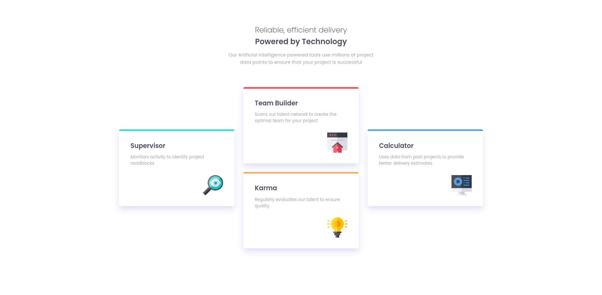

# Frontend Mentor - Four card feature section

## Welcome! 👋

Thanks for checking out this front-end coding challenge.

[Frontend Mentor](https://www.frontendmentor.io) challenges help you improve your coding skills by building realistic projects.

# Frontend Mentor - Four card feature section solution

This is a solution to the [Four card feature section challenge on Frontend Mentor](https://www.frontendmentor.io/challenges/four-card-feature-section-weK1eFYK). Frontend Mentor challenges help you improve your coding skills by building realistic projects. 

## Table of contents

- [Overview](#overview)
  - [The challenge](#the-challenge)
  - [Screenshot](#screenshot)
  - [Links](#links)
- [My process](#my-process)
  - [Built with](#built-with)
  - [What I learned](#what-i-learned)
  - [Continued development](#continued-development)
  - [Useful resources](#useful-resources)
- [Author](#author)
- [Acknowledgments](#acknowledgments)

## Overview

### The challenge

Users should be able to:

- View the optimal layout for the site depending on their device's screen size

### Screenshot

### Links

- Solution URL: [Here is my solution](https://your-solution-url.com)
- Live Site URL: [here is my live solution](https://your-live-site-url.com)

## My process

### Built with

- Semantic HTML5 markup
- CSS custom properties
- CSS Grid
- Mobile-first workflow

### What I learned

I challenge myself to use the css grid to build this project component, because I learned this recently but wanna practice that so.

### Continued development

I found the CSS grid amazing and very helpful in multi-column layout. So I think i am using the same in every layout projects.

### Useful resources

- [ Centering with CSS grid ](https://coryrylan.com/blog/how-to-center-in-css-with-css-grid) - This helped me better understand the CSS grid. I really liked this layout method and will use it going forward.
- [ A complete guide to the CSS grid](https://css-tricks.com/snippets/css/complete-guide-grid/) - This is an amazing article which helped me finally understand CSS grid. I'd recommend it to anyone still learning this concept.

## Author

- Frontend Mentor - [@Rohitgour03](https://www.frontendmentor.io/profile/Rohitgour03)
- Twitter - [@Rohitgour03](https://www.twitter.com/Rohitgour03)
